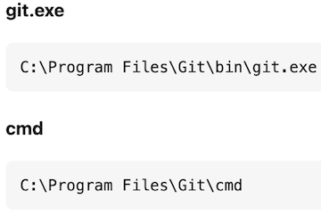

# Django
### A simple Django project
* A full-featured web application by Django

## Tutorial's Notes

### Getting started

* Installation Instruction
  * Install python
  * install pip
  * install git
  * Add git directory to windows environment variables path
  * 
  * Create repository on GitHub (django_project)
  * Edit README.md file
  * Create ssh key by using 'ssh-keygen' on cmd or terminal
  * Open ssh-key file and copy code
  * Create a new ssh key on GitHub
  * Add Tutor as collaborator on project
  * install Django using pip
  * Check django-admin
  * Start a new project by django-admin-> 'django-admin startproject django-project'
  * change the project name temporary
  * Download project from GitHub-> 'git clone ...'
  * Copy all file from django directory to cloned directory
  * Run server for the first time
  * Open project directory in vscode and run server again (localhost ip address)
  * Adjust .gitignor file
  * Edit git config and create first git commit and push to server
  * Now Everything is OK
* Django
  * Django is a back-end server side web framework.
  * Django is free, open source and written in Python.
  * Django makes it easier to build web pages using Python.
  * Django emphasizes **reusability** of components, also referred to as **DRY** (Don't Repeat Yourself), and comes with **ready-to-use** features like login system, database connection and CRUD operations (Create Read Update Delete).
  * Django is especially helpful for database driven websites
* How does Django Work?
  * Django follows the MVT design pattern (Model View Template).
  * Model - The data you want to present, usually data from a database. model.py
  * View - A request handler that returns the relevant template and content - based on the request from the user. view.py
  * Template - A text file (like an HTML file) containing the layout of the web page, with logic on how to display the data. templates
  * URL - Django also provides a way to navigate around the different pages in a website urls.py
* So, What is Going On?
  <ol>
  <li>Django receives the URL, checks the urls.py file, and calls the view that matches the URL.</li>
  <li>The view, located in views.py, checks for relevant models.</li>
  <li>The models are imported from the models.py file.</li>
  <li>The view then sends the data to a specified template in the template folder.</li>
  <li>The template contains HTML and Django tags, and with the data it returns finished HTML content back to the browser.</li></ol>
* Default Files
  * manage.py : Our main file that start pur application
  * __init__.py : make a python package
  * settings.py : where are we able to change some project settings
  * urls.py : where are we set our mapping system
  * wsgi.py : (django web server)Where are our django project library settings and we never touch it.
  * check admin page to show urls.py functionality
* Create App
  * D